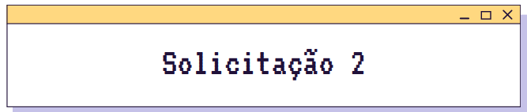
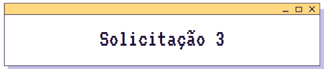

# Desafio JS Avançado - Quest API GitHub
Desafio de JavaScript avançado, com o uso do fetch e API do GitHub, proposto no curso DevQuest do Dev em Dobro.

## 🧩 Atividade Proposta 🧩

    

"Solicitação para acrescentar, no projeto que busca as informações na API do GitHub, **o número de follows e followers do usuário**."

- Criado o estilo para a div contendo ambos;
- Criado *divisor* entre as informações de texto do usuário e a "nova solicitação";
- Modificado o objeto **user**, em objetos/user.js, para conter o número de follows e followers.

    

"Apresentar as informações dos últimos eventos do usuário no GitHub, **separados nos tipos PushEvents e CreateEvent**."

- Criado o estilo dos elementos da seção *Eventos*;
- Gerado um *fetch*, no arquivo services/event.js, para a API do GitHub;
- Modificado o objeto user, em objects/user.js, com os eventos;
- Atualizado o script screen.js para, com condição, imprimir a lista dos eventos na tela;

    

"Buscar as informações dos repositórios do usuário do GitHub referentes à **quantidade de forks, estrelas, watchers e linguagem utilizada**."

- Criado o estilo dos ícones para a página;
- Modificado o método dos repositories, em screen.js, para incluir as informações pedidas.

## 🦉 Até Mais 🦉
Bora seguir codando!